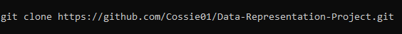
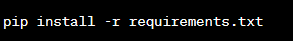
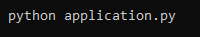

# Data-Representation-Project
<h1> Get Thirsty!</h1>
<h3>Welcome to Get Thirsty! A Flask-based voting system that settles the age-old question of which Tea is the best. Users can vote for their favorite tea, view the results, and explore tea categories using an external API.</h3>

## Table of Contents

- [Installation](#installation)
- [Usage](#usage)
- [Features](#features)

## Installation

1. Clone the repository:
   

2. Install the required dependencies:
   

3. Set up the SQL database by executing the provided SQL scripts found in the `voteDAO.py` file.

4. Configure the database connection in the `dbconfig.py` file.

5. Start the Flask server:
   

6. Open your web browser and access the application at [http://localhost:5000](http://localhost:5000).

7. It is also held on Pythonanywhere.com

## Usage

**Login First:**
1. Navigate to the login page (/loginPage)
2. Enter your email address. Must include a valid email address with @ symbol
3. Enter a password. It must contain 6 characters as well as least one uppercase and one lowercase and one number.
4. Hit submit

**Vote for your favorite tea:**

1. Voting page loads (/vote)
2. Choose your preferred tea from the available options.
3. Hover over your preferred tea and click enter. The vote count increase by 1.
3. Click the "Submit" button to submit your vote.
4. You will be redirected to a thank you page with a carousel effect.
5. The `/vote/<teaname>` endpoint is rate-limited to 1 request per minute per IP address.

**Thank you for Voting page:**
1. Thank you page loads (/thankyou)
2. The carousel effect will be enforced after 1 second.
3. Click on the see results to see the final outcome of the vote.

**View the voting results:**

1. From the thank you page, click the "View Results" button. (/results)
2. The total votes will be displayed in both table and chart form.

**Play the Tea Song:**

- On the results page, click the "Play Tea Song" button to start playing the tea-themed song.
- Click the same button to turn off the music.

**Explore Tea Categories using an external API:**

- On the results page, click the "More Tea Info" button.
- This will connect to an external API that provides information, images, and relevant data for various tea categories.
- External Api can be found here: https://boonakitea.cyclic.app/

**Note:** Usage limits are in place to ensure fair access and prevent abuse.
- The `/tea` endpoint is rate-limited to 10 requests per minute per IP address.
- The `/vote/<teaname>` endpoint is rate-limited to 1 request per minute per IP address.

## Features

- CRUD operations through a REST API using Flask.
- SQL database integration for storing and retrieving voting data.
- AJAX calls to perform CRUD operations and update the web interface dynamically.
- Voting system to settle the debate on the best tea.
- Results page displaying total votes in table and chart form.
- Carousel effect on the thank you page.
- Tea song that can be played and turned off.
- Integration with an external API for exploring tea categories.

